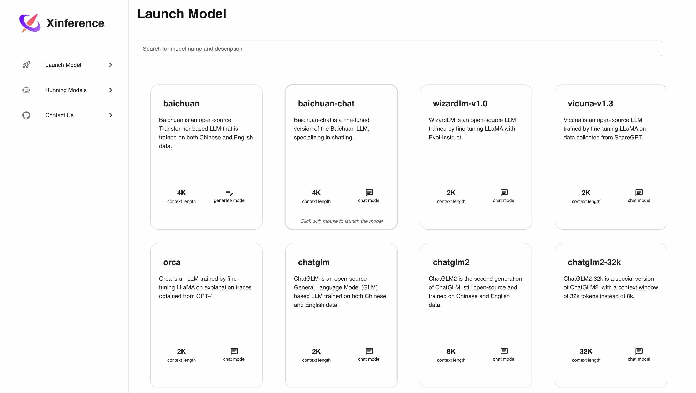

<div align="center">


# Xorbits Inference: Model Serving Made Easy 🤖

[](https://pypi.org/project/xinference/)
[](https://github.com/xorbitsai/inference/blob/main/LICENSE)
[](https://actions-badge.atrox.dev/xorbitsai/inference/goto?ref=main)
[](https://join.slack.com/t/xorbitsio/shared_invite/zt-1o3z9ucdh-RbfhbPVpx7prOVdM1CAuxg)
[](https://twitter.com/xorbitsio)

English | [中文介绍](README_zh_CN.md) | [日本語](README_ja_JP.md)
</div>
<br />


Xorbits Inference(Xinference) is a powerful and versatile library designed to serve language, 
speech recognition, and multimodal models. With Xorbits Inference, you can effortlessly deploy 
and serve your or state-of-the-art built-in models using just a single command. Whether you are a 
researcher, developer, or data scientist, Xorbits Inference empowers you to unleash the full 
potential of cutting-edge AI models.

<div align="center">
<i><a href="https://join.slack.com/t/xorbitsio/shared_invite/zt-1z3zsm9ep-87yI9YZ_B79HLB2ccTq4WA">👉 Join our Slack community!</a></i>
</div>

## 🔥 Hot Topics
### Framework Enhancements
- Incorporate vLLM: [#445](https://github.com/xorbitsai/inference/pull/445)
- Embedding model support: [#418](https://github.com/xorbitsai/inference/pull/418)
- LoRA support: [#271](https://github.com/xorbitsai/inference/issues/271)
- Multi-GPU support for PyTorch models: [#226](https://github.com/xorbitsai/inference/issues/226)
- Xinference dashboard: [#93](https://github.com/xorbitsai/inference/issues/93)
### New Models
- Built-in support for [CodeLLama](https://github.com/facebookresearch/codellama): [#414](https://github.com/xorbitsai/inference/pull/414) [#402](https://github.com/xorbitsai/inference/pull/402)
### Integrations
- [Dify](https://docs.dify.ai/advanced/model-configuration/xinference): an LLMOps platform that enables developers (and even non-developers) to quickly build useful applications based on large language models, ensuring they are visual, operable, and improvable.
- [Chatbox](https://chatboxai.app/): a desktop client for multiple cutting-edge LLM models, available on Windows, Mac and Linux.


## Key Features
🌟 **Model Serving Made Easy**: Simplify the process of serving large language, speech 
recognition, and multimodal models. You can set up and deploy your models
for experimentation and production with a single command.

⚡️ **State-of-the-Art Models**: Experiment with cutting-edge built-in models using a single 
command. Inference provides access to state-of-the-art open-source models!

🖥 **Heterogeneous Hardware Utilization**: Make the most of your hardware resources with
[ggml](https://github.com/ggerganov/ggml). Xorbits Inference intelligently utilizes heterogeneous
hardware, including GPUs and CPUs, to accelerate your model inference tasks.

⚙️ **Flexible API and Interfaces**: Offer multiple interfaces for interacting
with your models, supporting RPC, RESTful API(compatible with OpenAI API), CLI and WebUI
for seamless management and monitoring.

🌐 **Distributed Deployment**: Excel in distributed deployment scenarios, 
allowing the seamless distribution of model inference across multiple devices or machines.

🔌 **Built-in Integration with Third-Party Libraries**: Xorbits Inference seamlessly integrates
with popular third-party libraries including [LangChain](https://python.langchain.com/docs/integrations/providers/xinference), [LlamaIndex](https://gpt-index.readthedocs.io/en/stable/examples/llm/XinferenceLocalDeployment.html#i-run-pip-install-xinference-all-in-a-terminal-window), [Dify](https://docs.dify.ai/advanced/model-configuration/xinference), and [Chatbox](https://chatboxai.app/).

## Getting Started
Xinference can be installed via pip from PyPI. It is highly recommended to create a new virtual
environment to avoid conflicts.

### Installation
```bash
$ pip install "xinference"
```
`xinference` installs basic packages for serving models. 

#### Installation with GGML
To serve ggml models, you need to install the following extra dependencies:
```bash
$ pip install "xinference[ggml]"
```
If you want to achieve acceleration on 
different hardware, refer to the installation documentation of the corresponding package.
- [llama-cpp-python](https://github.com/abetlen/llama-cpp-python#installation-from-pypi-recommended) is required to run `baichuan`, `wizardlm-v1.0`, `vicuna-v1.3` and `orca`.
- [chatglm-cpp-python](https://github.com/li-plus/chatglm.cpp#getting-started) is required to run `chatglm` and `chatglm2`.

#### Installation with PyTorch
To serve PyTorch models, you need to install the following extra dependencies:
```bash
$ pip install "xinference[pytorch]"
```

#### Installation with all dependencies
If you want to serve all the supported models, install all the dependencies:
```bash
$ pip install "xinference[all]"
```


### Deployment
You can deploy Xinference locally with a single command or deploy it in a distributed cluster. 

#### Local
To start a local instance of Xinference, run the following command:
```bash
$ xinference
```

#### Distributed

To deploy Xinference in a cluster, you need to start a Xinference supervisor on one server and 
Xinference workers on the other servers. Follow the steps below:

**Starting the Supervisor**: On the server where you want to run the Xinference supervisor, run the following command:
```bash
$ xinference-supervisor -H "${supervisor_host}"
```
Replace `${supervisor_host}` with the actual host of your supervisor server.

**Starting the Workers**: On each of the other servers where you want to run Xinference workers, run the following command:
```bash
$ xinference-worker -e "http://${supervisor_host}:9997"
```

Once Xinference is running, an endpoint will be accessible for model management via CLI or
Xinference  client.

- For local deployment, the endpoint will be `http://localhost:9997`.
- For cluster deployment, the endpoint will be `http://${supervisor_host}:9997`, where
`${supervisor_host}` is the hostname or IP address of the server where the supervisor is running.

You can also view a web UI using the Xinference endpoint to chat with all the 
builtin models.



### Xinference CLI
Xinference provides a command line interface (CLI) for model management. Here are some useful 
commands:

- Launch a model (a model UID will be returned): `xinference launch`
- List running models: `xinference list`
- List all the supported models: `xinference registrations`
- Terminate a model: `xinference terminate --model-uid ${model_uid}`

### Xinference Client
Xinference also provides a client for managing and accessing models programmatically:

```python
from xinference.client import Client

client = Client("http://localhost:9997")
model_uid = client.launch_model(model_name="chatglm2")
model = client.get_model(model_uid)

chat_history = []
prompt = "What is the largest animal?"
model.chat(
    prompt,
    chat_history,
    generate_config={"max_tokens": 1024}
)
```

Result:
```json
{
  "id": "chatcmpl-8d76b65a-bad0-42ef-912d-4a0533d90d61",
  "model": "56f69622-1e73-11ee-a3bd-9af9f16816c6",
  "object": "chat.completion",
  "created": 1688919187,
  "choices": [
    {
      "index": 0,
      "message": {
        "role": "assistant",
        "content": "The largest animal that has been scientifically measured is the blue whale, which has a maximum length of around 23 meters (75 feet) for adult animals and can weigh up to 150,000 pounds (68,000 kg). However, it is important to note that this is just an estimate and that the largest animal known to science may be larger still. Some scientists believe that the largest animals may not have a clear \"size\" in the same way that humans do, as their size can vary depending on the environment and the stage of their life."
      },
      "finish_reason": "None"
    }
  ],
  "usage": {
    "prompt_tokens": -1,
    "completion_tokens": -1,
    "total_tokens": -1
  }
}
```

See [examples](examples) for more examples.


## Builtin models
To view the builtin models, run the following command:
```bash
$ xinference registrations
```

| Type | Name                | Language     | Ability                |
|------|---------------------|--------------|------------------------|
| LLM  | baichuan            | ['en', 'zh'] | ['embed', 'generate']  |
| LLM  | baichuan-2          | ['en', 'zh'] | ['embed', 'generate']  |
| LLM  | baichuan-chat       | ['en', 'zh'] | ['embed', 'chat']      |
| LLM  | baichuan-2-chat     | ['en', 'zh'] | ['embed', 'chat']      |
| LLM  | chatglm             | ['en', 'zh'] | ['embed', 'chat']      |
| LLM  | chatglm2            | ['en', 'zh'] | ['embed', 'chat']      |
| LLM  | chatglm2-32k        | ['en', 'zh'] | ['embed', 'chat']      |
| LLM  | code-llama          | ['en']       | ['generate']           |
| LLM  | code-llama-instruct | ['en']       | ['chat']               |
| LLM  | code-llama-python   | ['en']       | ['generate']           |
| LLM  | falcon              | ['en']       | ['embed', 'generate']  |
| LLM  | falcon-instruct     | ['en']       | ['embed', 'chat']      |
| LLM  | gpt-2               | ['en']       | ['generate']           |
| LLM  | internlm            | ['en', 'zh'] | ['embed', 'generate']  |
| LLM  | internlm-chat       | ['en', 'zh'] | ['embed', 'chat']      |
| LLM  | internlm-chat-8k    | ['en', 'zh'] | ['embed', 'chat']      |
| LLM  | llama-2             | ['en']       | ['embed', 'generate']  |
| LLM  | llama-2-chat        | ['en']       | ['embed', 'chat']      |
| LLM  | opt                 | ['en']       | ['embed', 'generate']  |
| LLM  | orca                | ['en']       | ['embed', 'chat']      |
| LLM  | qwen-chat           | ['en', 'zh'] | ['embed', 'chat']      |
| LLM  | starchat-beta       | ['en']       | ['embed', 'chat']      |
| LLM  | starcoder           | ['en']       | ['generate']           |
| LLM  | starcoderplus       | ['en']       | ['embed', 'generate']  |
| LLM  | vicuna-v1.3         | ['en']       | ['embed', 'chat']      |
| LLM  | vicuna-v1.5         | ['en']       | ['embed', 'chat']      |
| LLM  | vicuna-v1.5-16k     | ['en']       | ['embed', 'chat']      |
| LLM  | wizardlm-v1.0       | ['en']       | ['embed', 'chat']      |
| LLM  | wizardmath-v1.0     | ['en']       | ['embed', 'chat']      |
| LLM  | OpenBuddy-v11.1     | ['en', 'zh'] | ['embed', 'chat']      |

For in-depth details on the built-in models, please refer to [built-in models](https://inference.readthedocs.io/en/latest/models/builtin/index.html). 

**NOTE**:
- Xinference will download models automatically for you, and by default the models will be saved under `${USER}/.xinference/cache`. 
- If you have trouble downloading models from the Hugging Face, run `export XINFERENCE_MODEL_SRC=xorbits` to download models from our mirror site.

## Custom models
Please refer to [custom models](https://inference.readthedocs.io/en/latest/models/custom.html).
