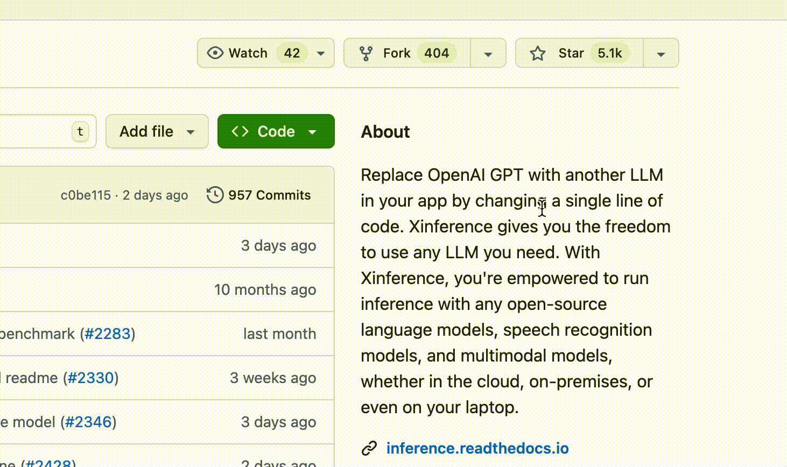

<div align="center">


# Xorbits Inference: Model Serving Made Easy 🤖

<p align="center">
  <a href="https://xinference.io/en">Xinference Enterprise</a> ·
  <a href="https://inference.readthedocs.io/en/latest/getting_started/installation.html#installation">Self-hosting</a> ·
  <a href="https://inference.readthedocs.io/">Documentation</a>
</p>

[](https://pypi.org/project/xinference/)
[](https://github.com/xorbitsai/inference/blob/main/LICENSE)
[](https://actions-badge.atrox.dev/xorbitsai/inference/goto?ref=main)
[](https://discord.gg/Xw9tszSkr5)
[](https://twitter.com/xorbitsio)

<p align="center">
  <a href="./README.md"></a>
  <a href="./README_zh_CN.md"></a>
  <a href="./README_ja_JP.md"></a>
</p>

</div>
<br />


Xorbits Inference(Xinference) is a powerful and versatile library designed to serve language, 
speech recognition, and multimodal models. With Xorbits Inference, you can effortlessly deploy 
and serve your or state-of-the-art built-in models using just a single command. Whether you are a 
researcher, developer, or data scientist, Xorbits Inference empowers you to unleash the full 
potential of cutting-edge AI models.

<div align="center">
<i><a href="https://discord.gg/Xw9tszSkr5">👉 Join our Discord community!</a></i>
</div>

## 🔥 Hot Topics
### Framework Enhancements
- Auto batch: Multiple concurrent requests are automatically batched, significantly improving throughput: [#4197](https://github.com/xorbitsai/inference/pull/4197)
- [Xllamacpp](https://github.com/xorbitsai/xllamacpp): New llama.cpp Python binding, maintained by Xinference team, supports continuous batching and is more production-ready.: [#2997](https://github.com/xorbitsai/inference/pull/2997)
- Distributed inference: running models across workers: [#2877](https://github.com/xorbitsai/inference/pull/2877)
- VLLM enhancement: Shared KV cache across multiple replicas: [#2732](https://github.com/xorbitsai/inference/pull/2732)
- Support Continuous batching for Transformers engine: [#1724](https://github.com/xorbitsai/inference/pull/1724)
- Support MLX backend for Apple Silicon chips: [#1765](https://github.com/xorbitsai/inference/pull/1765)
- Support specifying worker and GPU indexes for launching models: [#1195](https://github.com/xorbitsai/inference/pull/1195)
- Support SGLang backend: [#1161](https://github.com/xorbitsai/inference/pull/1161)
### New Models
- Built-in support for [Qwen-Image-Layered](https://qwen.ai/blog?id=qwen-image-layered): [#4395](https://github.com/xorbitsai/inference/pull/4395)
- Built-in support for [DeepSeek-V3.2](https://api-docs.deepseek.com/news/news251201): [#4344](https://github.com/xorbitsai/inference/pull/4344)
- Built-in support for [Z-Image-Turbo](https://tongyi-mai.github.io/Z-Image-blog/): [#4333](https://github.com/xorbitsai/inference/pull/4333)
- Built-in support for [PaddleOCR-VL](https://ernie.baidu.com/blog/posts/paddleocr-vl/): [#4304](https://github.com/xorbitsai/inference/pull/4304)
- Built-in support for [FLUX.2-dev](https://github.com/black-forest-labs/flux2): [#4292](https://github.com/xorbitsai/inference/pull/4292)
- Built-in support for [HunyuanOCR](https://github.com/Tencent-Hunyuan/HunyuanOCR): [#4290](https://github.com/xorbitsai/inference/pull/4290)
- Built-in support for [DeepSeek-OCR](https://github.com/deepseek-ai/DeepSeek-OCR): [#4187](https://github.com/xorbitsai/inference/pull/4187)
- Built-in support for [Qwen3-Omni](https://github.com/QwenLM/Qwen3-Omni): [#4137](https://github.com/xorbitsai/inference/pull/4137)
### Integrations
- [Dify](https://docs.dify.ai/advanced/model-configuration/xinference): an LLMOps platform that enables developers (and even non-developers) to quickly build useful applications based on large language models, ensuring they are visual, operable, and improvable.
- [FastGPT](https://github.com/labring/FastGPT): a knowledge-based platform built on the LLM, offers out-of-the-box data processing and model invocation capabilities, allows for workflow orchestration through Flow visualization.
- [RAGFlow](https://github.com/infiniflow/ragflow): is an open-source RAG engine based on deep document understanding.
- [MaxKB](https://github.com/1Panel-dev/MaxKB): MaxKB = Max Knowledge Brain, it is a powerful and easy-to-use AI assistant that integrates Retrieval-Augmented Generation (RAG) pipelines, supports robust workflows, and provides advanced MCP tool-use capabilities.
- [Chatbox](https://chatboxai.app/): a desktop client for multiple cutting-edge LLM models, available on Windows, Mac and Linux.


## Key Features
🌟 **Model Serving Made Easy**: Simplify the process of serving large language, speech 
recognition, and multimodal models. You can set up and deploy your models
for experimentation and production with a single command.

⚡️ **State-of-the-Art Models**: Experiment with cutting-edge built-in models using a single 
command. Inference provides access to state-of-the-art open-source models!

🖥 **Heterogeneous Hardware Utilization**: Make the most of your hardware resources with
[ggml](https://github.com/ggerganov/ggml). Xorbits Inference intelligently utilizes heterogeneous
hardware, including GPUs and CPUs, to accelerate your model inference tasks.

⚙️ **Flexible API and Interfaces**: Offer multiple interfaces for interacting
with your models, supporting OpenAI compatible RESTful API (including Function Calling API), RPC, CLI 
and WebUI for seamless model management and interaction.

🌐 **Distributed Deployment**: Excel in distributed deployment scenarios, 
allowing the seamless distribution of model inference across multiple devices or machines.

🔌 **Built-in Integration with Third-Party Libraries**: Xorbits Inference seamlessly integrates
with popular third-party libraries including [LangChain](https://python.langchain.com/docs/integrations/providers/xinference), [LlamaIndex](https://gpt-index.readthedocs.io/en/stable/examples/llm/XinferenceLocalDeployment.html#i-run-pip-install-xinference-all-in-a-terminal-window), [Dify](https://docs.dify.ai/advanced/model-configuration/xinference), and [Chatbox](https://chatboxai.app/).

## Why Xinference
| Feature                                        | Xinference | FastChat | OpenLLM | RayLLM |
|------------------------------------------------|------------|----------|---------|--------|
| OpenAI-Compatible RESTful API                  | ✅ | ✅ | ✅ | ✅ |
| vLLM Integrations                              | ✅ | ✅ | ✅ | ✅ |
| More Inference Engines (GGML, TensorRT)        | ✅ | ❌ | ✅ | ✅ |
| More Platforms (CPU, Metal)                    | ✅ | ✅ | ❌ | ❌ |
| Multi-node Cluster Deployment                  | ✅ | ❌ | ❌ | ✅ |
| Image Models (Text-to-Image)                   | ✅ | ✅ | ❌ | ❌ |
| Text Embedding Models                          | ✅ | ❌ | ❌ | ❌ |
| Multimodal Models                              | ✅ | ❌ | ❌ | ❌ |
| Audio Models                                   | ✅ | ❌ | ❌ | ❌ |
| More OpenAI Functionalities (Function Calling) | ✅ | ❌ | ❌ | ❌ |

## Using Xinference

- **Self-hosting Xinference Community Edition</br>**
Quickly get Xinference running in your environment with this [starter guide](#getting-started).
Use our [documentation](https://inference.readthedocs.io/) for further references and more in-depth instructions.

- **Xinference for enterprise / organizations</br>**
We provide additional enterprise-centric features. [send us an email](mailto:business@xprobe.io?subject=[GitHub]Business%20License%20Inquiry) to discuss enterprise needs. </br>

## Staying Ahead

Star Xinference on GitHub and be instantly notified of new releases.



## Getting Started

* [Docs](https://inference.readthedocs.io/en/latest/index.html)
* [Built-in Models](https://inference.readthedocs.io/en/latest/models/builtin/index.html)
* [Custom Models](https://inference.readthedocs.io/en/latest/models/custom.html)
* [Deployment Docs](https://inference.readthedocs.io/en/latest/getting_started/using_xinference.html)
* [Examples and Tutorials](https://inference.readthedocs.io/en/latest/examples/index.html)

### Jupyter Notebook

The lightest way to experience Xinference is to try our [Jupyter Notebook on Google Colab](https://colab.research.google.com/github/xorbitsai/inference/blob/main/examples/Xinference_Quick_Start.ipynb).

### Docker 

Nvidia GPU users can start Xinference server using [Xinference Docker Image](https://inference.readthedocs.io/en/latest/getting_started/using_docker_image.html). Prior to executing the installation command, ensure that both [Docker](https://docs.docker.com/get-docker/) and [CUDA](https://developer.nvidia.com/cuda-downloads) are set up on your system.

```bash
docker run --name xinference -d -p 9997:9997 -e XINFERENCE_HOME=/data -v </on/your/host>:/data --gpus all xprobe/xinference:latest xinference-local -H 0.0.0.0
```

### K8s via helm

Ensure that you have GPU support in your Kubernetes cluster, then install as follows.

```
# add repo
helm repo add xinference https://xorbitsai.github.io/xinference-helm-charts

# update indexes and query xinference versions
helm repo update xinference
helm search repo xinference/xinference --devel --versions

# install xinference
helm install xinference xinference/xinference -n xinference --version 0.0.1-v<xinference_release_version>
```

For more customized installation methods on K8s, please refer to the [documentation](https://inference.readthedocs.io/en/latest/getting_started/using_kubernetes.html).

### Quick Start

Install Xinference by using pip as follows. (For more options, see [Installation page](https://inference.readthedocs.io/en/latest/getting_started/installation.html).)

```bash
pip install "xinference[all]"
```

To start a local instance of Xinference, run the following command:

```bash
$ xinference-local
```

Once Xinference is running, there are multiple ways you can try it: via the web UI, via cURL,
 via the command line, or via the Xinference’s python client. Check out our [docs]( https://inference.readthedocs.io/en/latest/getting_started/using_xinference.html#run-xinference-locally) for the guide.


## Getting involved

| Platform                                                                                        | Purpose                                     |
|-------------------------------------------------------------------------------------------------|---------------------------------------------|
| [Github Issues](https://github.com/xorbitsai/inference/issues)                                  | Reporting bugs and filing feature requests. |
| [Discord](https://discord.gg/Xw9tszSkr5) | Collaborating with other Xinference users.  |
| [Twitter](https://twitter.com/xorbitsio)                                                        | Staying up-to-date on new features.         |

## Citation

If this work is helpful, please kindly cite as:

```bibtex
@inproceedings{lu2024xinference,
    title = "Xinference: Making Large Model Serving Easy",
    author = "Lu, Weizheng and Xiong, Lingfeng and Zhang, Feng and Qin, Xuye and Chen, Yueguo",
    booktitle = "Proceedings of the 2024 Conference on Empirical Methods in Natural Language Processing: System Demonstrations",
    month = nov,
    year = "2024",
    address = "Miami, Florida, USA",
    publisher = "Association for Computational Linguistics",
    url = "https://aclanthology.org/2024.emnlp-demo.30",
    pages = "291--300",
}
```

## Contributors

<a href="https://github.com/xorbitsai/inference/graphs/contributors">
  
</a>

## Star History

[](https://star-history.com/#xorbitsai/inference&Date)