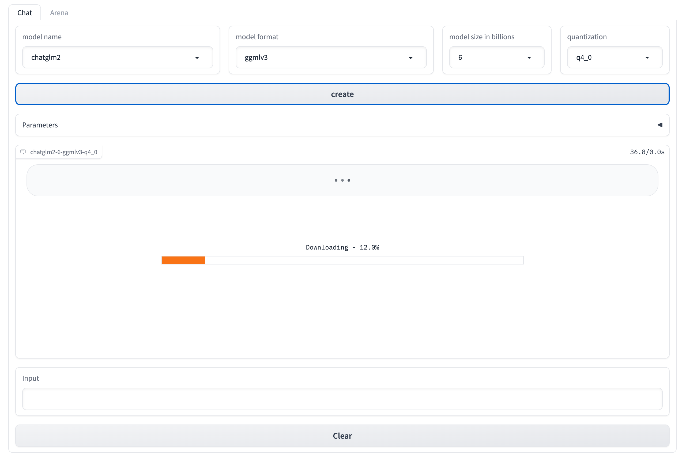

[](https://pypi.org/project/xinference/)
[](https://github.com/xorbitsai/inference/blob/main/LICENSE)
[](https://actions-badge.atrox.dev/xorbitsai/inference/goto?ref=main)
[](https://join.slack.com/t/xorbitsio/shared_invite/zt-1o3z9ucdh-RbfhbPVpx7prOVdM1CAuxg)
[](https://twitter.com/xorbitsio)

# Xorbits Inference: Model Serving Made Easy 🤖

Welcome to the Xorbits Inference GitHub repository!

Xorbits Inference(Xinference) is a powerful and versatile library designed to serve language, 
speech recognition, and multimodal models. With Xorbits Inference, you can effortlessly deploy 
and serve your or state-of-the-art built-in models using just a single command. Whether you are a 
researcher, developer, or data scientist, Xorbits Inference empowers you to unleash the full 
potential of cutting-edge AI models.

Currently, Xorbits Inference relies on [ggml](https://github.com/ggerganov/ggml) for model serving,
which is specifically designed to enable large models and high performance on commodity hardware. 
We are actively working on expanding Xorbits Inference's support to include additional runtimes, 
including PyTorch and JAX, in the near future.


## Key Features
🌟 **Model Serving Made Easy**: Inference simplifies the process of serving large language, speech 
recognition, and multimodal models. You can set up and deploy your models
for experimentation and production with a single command.

⚡️ **State-of-the-Art Models**: Experiment with cutting-edge built-in models using a single 
command. Inference provides access to state-of-the-art open-source models!

🖥 **Heterogeneous Hardware Utilization**: Make the most of your hardware resources. Xorbits 
Inference intelligently utilizes heterogeneous hardware, including GPUs and CPUs, to maximize
performance and accelerate your model inference tasks.

⚙️ **Flexible API and Interfaces**: Xorbits Inference offers multiple interfaces for interacting
with your models. You can utilize the RPC and RESTful API(compatible with OpenAI API) to integrate
your models with existing systems or use the command-line interface (CLI) and the intuitive WebUI
for seamless management and monitoring.

🌐 **Distributed Deployment**: Xorbits Inference excels in distributed deployment scenarios, 
allowing the seamless distribution of model inference across multiple devices or machines. It
leverages distributed computing techniques to parallelize and scale the inference process.

🔌 **Built-in Integration with Third-Party Libraries**: Xorbits Inference seamlessly integrates
with popular third-party libraries like LangChain and LlamaIndex. (Coming soon)

## Getting Started
Xinference can be installed via pip from PyPI. It is highly recommended to create a new virtual
environment to avoid conflicts.
```bash
$ pip install xinference
```
To serve models, you need to install the necessary dependencies. You can refer to the installation documentation of 
the respective package to obtain acceleration on different hardware.
- [llama-cpp-python](https://github.com/abetlen/llama-cpp-python#installation-from-pypi-recommended) is required to run `baichuan`, `wizardlm-v1.0`, `vicuna-v1.3` and `orca`.
- [chatglm-cpp-python](https://github.com/li-plus/chatglm.cpp#getting-started) is required to run `chatglm` and `chatglm2`.


### Deployment
You can deploy Xinference locally with a single command or deploy it in a distributed cluster. 

#### Local
To start a local instance of Xinference, run the following command:
```bash
$ xinference
```
If you want to configure some options, you can refer to the following commands:
```bash
$ xinference -H "localhost" \
             -p 9997 \
             --log-level INFO
```

#### Distributed

To deploy Xinference in a cluster, you need to start a Xinference supervisor on one server and 
Xinference workers on the other servers. Follow the steps below:

**Starting the Supervisor**: On the server where you want to run the Xinference supervisor, run the following command:
```bash
$ xinference-supervisor -H "${supervisor_host}" \
                        -p 9997 \
                        --log-level INFO
```
Replace `${supervisor_host}` with the actual host of your supervisor server.

**Starting the Workers**: On each of the other servers where you want to run Xinference workers, run the following command:
```bash
$ xinference-worker -e "http://${supervisor_host}:9997" \
                    -H "0.0.0.0" \
                    --log-level INFO
```

Once Xinference is running, an endpoint will be accessible for model management via CLI or
Xinference  client.

- For local deployment, the endpoint will be `http://localhost:9997`.
- For cluster deployment, the endpoint will be `http://${supervisor_host}:9997`, where
`${supervisor_host}` is the hostname or IP address of the server where the supervisor is running.

You can also view a web UI using the Xinference endpoint to chat with all the 
builtin models. You can even **chat with two cutting-edge AI models side-by-side to compare
their performance**!



### Xinference CLI
Xinference provides a command line interface (CLI) for model management. Here are some useful 
commands:

- Launch a model (a model UID will be returned): `xinference launch`
- List running models: `xinference list`
- List all the builtin models: `xinference list --all`
- Terminate a model: `xinference terminate --model-uid ${model_uid}`

### Xinference Client
Xinference also provides a client for managing and accessing models programmatically:

```python
from xinference.client import Client

client = Client("http://localhost:9997")
model_uid = client.launch_model(model_name="chatglm2")
model = client.get_model(model_uid)

chat_history = []
prompt = "What is the largest animal?"
model.chat(
            prompt,
            chat_history,
            generate_config={"max_tokens": 1024}
        )
```

Result:
```json
{
  "id": "chatcmpl-8d76b65a-bad0-42ef-912d-4a0533d90d61",
  "model": "56f69622-1e73-11ee-a3bd-9af9f16816c6",
  "object": "chat.completion",
  "created": 1688919187,
  "choices": [
    {
      "index": 0,
      "message": {
        "role": "assistant",
        "content": "The largest animal that has been scientifically measured is the blue whale, which has a maximum length of around 23 meters (75 feet) for adult animals and can weigh up to 150,000 pounds (68,000 kg). However, it is important to note that this is just an estimate and that the largest animal known to science may be larger still. Some scientists believe that the largest animals may not have a clear \"size\" in the same way that humans do, as their size can vary depending on the environment and the stage of their life."
      },
      "finish_reason": "None"
    }
  ],
  "usage": {
    "prompt_tokens": -1,
    "completion_tokens": -1,
    "total_tokens": -1
  }
}
```

See [examples](examples) for more examples.


## Builtin models
To view the builtin models, run the following command:
```bash
$ xinference list --all
```

| Name                 | Format  | Size (in billions) | Quantization                                                                                                                   |
| -------------------- | ------- | ------------------ |--------------------------------------------------------------------------------------------------------------------------------|
| baichuan             | ggmlv3  | [7]                | ['q2_K', 'q3_K_L', 'q3_K_M', 'q3_K_S', 'q4_0', 'q4_1', 'q4_K_M', 'q4_K_S', 'q5_0', 'q5_1', 'q5_K_M', 'q5_K_S', 'q6_K', 'q8_0'] |
| wizardlm-v1.0        | ggmlv3  | [7, 13, 33]        | ['q2_K', 'q3_K_L', 'q3_K_M', 'q3_K_S', 'q4_0', 'q4_1', 'q4_K_M', 'q4_K_S', 'q5_0', 'q5_1', 'q5_K_M', 'q5_K_S', 'q6_K', 'q8_0'] |
| vicuna-v1.3          | ggmlv3  | [7, 13]            | ['q2_K', 'q3_K_L', 'q3_K_M', 'q3_K_S', 'q4_0', 'q4_1', 'q4_K_M', 'q4_K_S', 'q5_0', 'q5_1', 'q5_K_M', 'q5_K_S', 'q6_K', 'q8_0'] |
| orca                 | ggmlv3  | [3, 7, 13]         | ['q4_0', 'q4_1', 'q5_0', 'q5_1', 'q8_0']                                                                                       |
| chatglm              | ggmlv3  | [6]                | ['q4_0', 'q4_1', 'q5_0', 'q5_1', 'q8_0']                                                                                       |
| chatglm2             | ggmlv3  | [6]                | ['q4_0', 'q4_1', 'q5_0', 'q5_1', 'q8_0']                                                                                       |

**NOTE**:
- Xinference will download models automatically for you, and by default the models will be saved under `${USER}/.xinference/cache`.

## Roadmap
Xinference is currently under active development. Here's a roadmap outlining our planned 
developments for the next few weeks:

### PyTorch Support
With PyTorch integration, users will be able to seamlessly utilize PyTorch models from Hugging Face
within Xinference.

### Langchain & LlamaIndex integration
With Xinference, it will be much easier for users to use these libraries and build applications 
with LLMs.
