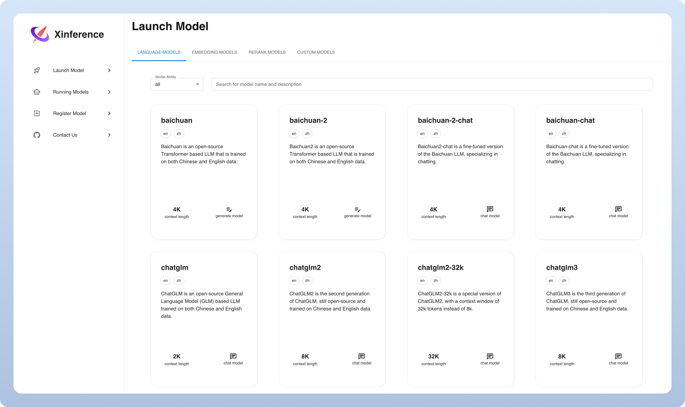

<div align="center">


# Xorbits Inference: Model Serving Made Easy 🤖

[](https://pypi.org/project/xinference/)
[](https://github.com/xorbitsai/inference/blob/main/LICENSE)
[](https://actions-badge.atrox.dev/xorbitsai/inference/goto?ref=main)
[](https://join.slack.com/t/xorbitsio/shared_invite/zt-1o3z9ucdh-RbfhbPVpx7prOVdM1CAuxg)
[](https://twitter.com/xorbitsio)

English | [中文介绍](README_zh_CN.md) | [日本語](README_ja_JP.md)
</div>
<br />


Xorbits Inference(Xinference) is a powerful and versatile library designed to serve language, 
speech recognition, and multimodal models. With Xorbits Inference, you can effortlessly deploy 
and serve your or state-of-the-art built-in models using just a single command. Whether you are a 
researcher, developer, or data scientist, Xorbits Inference empowers you to unleash the full 
potential of cutting-edge AI models.

<div align="center">
<i><a href="https://join.slack.com/t/xorbitsio/shared_invite/zt-1z3zsm9ep-87yI9YZ_B79HLB2ccTq4WA">👉 Join our Slack community!</a></i>
</div>

## 🔥 Hot Topics
### Framework Enhancements
- Support Continuous batching for Transformers engine: [#1724](https://github.com/xorbitsai/inference/pull/1724)
- Support MLX backend for Apple Silicon chips: [#1765](https://github.com/xorbitsai/inference/pull/1765)
- Support specifying worker and GPU indexes for launching models: [#1195](https://github.com/xorbitsai/inference/pull/1195)
- Support SGLang backend: [#1161](https://github.com/xorbitsai/inference/pull/1161)
- Support LoRA for LLM and image models: [#1080](https://github.com/xorbitsai/inference/pull/1080)
- Support speech recognition model: [#929](https://github.com/xorbitsai/inference/pull/929)
- Metrics support: [#906](https://github.com/xorbitsai/inference/pull/906)
### New Models
- Built-in support for [Qwen 2.5 Series](https://qwenlm.github.io/blog/qwen2.5/): [#2325](https://github.com/xorbitsai/inference/pull/2325)
- Built-in support for [Fish Speech V1.4](https://huggingface.co/fishaudio/fish-speech-1.4): [#2295](https://github.com/xorbitsai/inference/pull/2295)
- Built-in support for [DeepSeek-V2.5](https://huggingface.co/deepseek-ai/DeepSeek-V2.5): [#2292](https://github.com/xorbitsai/inference/pull/2292)
- Built-in support for [Qwen2-Audio](https://github.com/QwenLM/Qwen2-Audio): [#2271](https://github.com/xorbitsai/inference/pull/2271)
- Built-in support for [Qwen2-vl-instruct](https://github.com/QwenLM/Qwen2-VL): [#2205](https://github.com/xorbitsai/inference/pull/2205)
- Built-in support for [MiniCPM3-4B](https://huggingface.co/openbmb/MiniCPM3-4B): [#2263](https://github.com/xorbitsai/inference/pull/2263)
- Built-in support for [CogVideoX](https://github.com/THUDM/CogVideo): [#2049](https://github.com/xorbitsai/inference/pull/2049)
- Built-in support for [flux.1-schnell & flux.1-dev](https://www.basedlabs.ai/tools/flux1): [#2007](https://github.com/xorbitsai/inference/pull/2007)
### Integrations
- [Dify](https://docs.dify.ai/advanced/model-configuration/xinference): an LLMOps platform that enables developers (and even non-developers) to quickly build useful applications based on large language models, ensuring they are visual, operable, and improvable.
- [FastGPT](https://github.com/labring/FastGPT): a knowledge-based platform built on the LLM, offers out-of-the-box data processing and model invocation capabilities, allows for workflow orchestration through Flow visualization.
- [Chatbox](https://chatboxai.app/): a desktop client for multiple cutting-edge LLM models, available on Windows, Mac and Linux.
- [RAGFlow](https://github.com/infiniflow/ragflow): is an open-source RAG engine based on deep document understanding.


## Key Features
🌟 **Model Serving Made Easy**: Simplify the process of serving large language, speech 
recognition, and multimodal models. You can set up and deploy your models
for experimentation and production with a single command.

⚡️ **State-of-the-Art Models**: Experiment with cutting-edge built-in models using a single 
command. Inference provides access to state-of-the-art open-source models!

🖥 **Heterogeneous Hardware Utilization**: Make the most of your hardware resources with
[ggml](https://github.com/ggerganov/ggml). Xorbits Inference intelligently utilizes heterogeneous
hardware, including GPUs and CPUs, to accelerate your model inference tasks.

⚙️ **Flexible API and Interfaces**: Offer multiple interfaces for interacting
with your models, supporting OpenAI compatible RESTful API (including Function Calling API), RPC, CLI 
and WebUI for seamless model management and interaction.

🌐 **Distributed Deployment**: Excel in distributed deployment scenarios, 
allowing the seamless distribution of model inference across multiple devices or machines.

🔌 **Built-in Integration with Third-Party Libraries**: Xorbits Inference seamlessly integrates
with popular third-party libraries including [LangChain](https://python.langchain.com/docs/integrations/providers/xinference), [LlamaIndex](https://gpt-index.readthedocs.io/en/stable/examples/llm/XinferenceLocalDeployment.html#i-run-pip-install-xinference-all-in-a-terminal-window), [Dify](https://docs.dify.ai/advanced/model-configuration/xinference), and [Chatbox](https://chatboxai.app/).

## Why Xinference
| Feature                                        | Xinference | FastChat | OpenLLM | RayLLM |
|------------------------------------------------|------------|----------|---------|--------|
| OpenAI-Compatible RESTful API                  | ✅ | ✅ | ✅ | ✅ |
| vLLM Integrations                              | ✅ | ✅ | ✅ | ✅ |
| More Inference Engines (GGML, TensorRT)        | ✅ | ❌ | ✅ | ✅ |
| More Platforms (CPU, Metal)                    | ✅ | ✅ | ❌ | ❌ |
| Multi-node Cluster Deployment                  | ✅ | ❌ | ❌ | ✅ |
| Image Models (Text-to-Image)                   | ✅ | ✅ | ❌ | ❌ |
| Text Embedding Models                          | ✅ | ❌ | ❌ | ❌ |
| Multimodal Models                              | ✅ | ❌ | ❌ | ❌ |
| Audio Models                                   | ✅ | ❌ | ❌ | ❌ |
| More OpenAI Functionalities (Function Calling) | ✅ | ❌ | ❌ | ❌ |

## Getting Started

**Please give us a star before you begin, and you'll receive instant notifications for every new release on GitHub!**

* [Docs](https://inference.readthedocs.io/en/latest/index.html)
* [Built-in Models](https://inference.readthedocs.io/en/latest/models/builtin/index.html)
* [Custom Models](https://inference.readthedocs.io/en/latest/models/custom.html)
* [Deployment Docs](https://inference.readthedocs.io/en/latest/getting_started/using_xinference.html)
* [Examples and Tutorials](https://inference.readthedocs.io/en/latest/examples/index.html)

### Jupyter Notebook

The lightest way to experience Xinference is to try our [Jupyter Notebook on Google Colab](https://colab.research.google.com/github/xorbitsai/inference/blob/main/examples/Xinference_Quick_Start.ipynb).

### Docker 

Nvidia GPU users can start Xinference server using [Xinference Docker Image](https://inference.readthedocs.io/en/latest/getting_started/using_docker_image.html). Prior to executing the installation command, ensure that both [Docker](https://docs.docker.com/get-docker/) and [CUDA](https://developer.nvidia.com/cuda-downloads) are set up on your system.

```bash
docker run --name xinference -d -p 9997:9997 -e XINFERENCE_HOME=/data -v </on/your/host>:/data --gpus all xprobe/xinference:latest xinference-local -H 0.0.0.0
```

### K8s via helm

Ensure that you have GPU support in your Kubernetes cluster, then install as follows.

```
# add repo
helm repo add xinference https://xorbitsai.github.io/xinference-helm-charts

# update indexes and query xinference versions
helm repo update xinference
helm search repo xinference/xinference --devel --versions

# install xinference
helm install xinference xinference/xinference -n xinference --version 0.0.1-v<xinference_release_version>
```

For more customized installation methods on K8s, please refer to the [documentation](https://inference.readthedocs.io/en/latest/getting_started/using_kubernetes.html).

### Quick Start

Install Xinference by using pip as follows. (For more options, see [Installation page](https://inference.readthedocs.io/en/latest/getting_started/installation.html).)

```bash
pip install "xinference[all]"
```

To start a local instance of Xinference, run the following command:

```bash
$ xinference-local
```

Once Xinference is running, there are multiple ways you can try it: via the web UI, via cURL,
 via the command line, or via the Xinference’s python client. Check out our [docs]( https://inference.readthedocs.io/en/latest/getting_started/using_xinference.html#run-xinference-locally) for the guide.



## Getting involved

| Platform                                                                                      | Purpose                                            |
|-----------------------------------------------------------------------------------------------|----------------------------------------------------|
| [Github Issues](https://github.com/xorbitsai/inference/issues)                                | Reporting bugs and filing feature requests.        |
| [Slack](https://join.slack.com/t/xorbitsio/shared_invite/zt-1o3z9ucdh-RbfhbPVpx7prOVdM1CAuxg) | Collaborating with other Xorbits users.            |
| [Twitter](https://twitter.com/xorbitsio)                                                      | Staying up-to-date on new features.                |

## Contributors

<a href="https://github.com/xorbitsai/inference/graphs/contributors">
  
</a>
