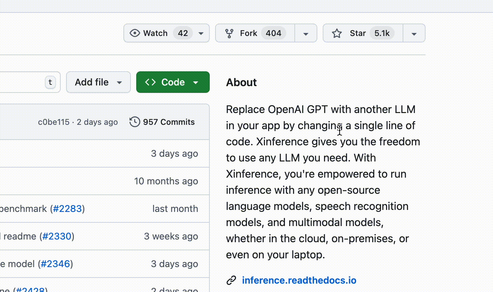
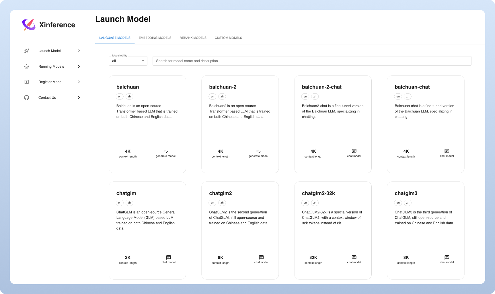

<div align="center">


# Xorbits Inference: Servir modelos con facilidad 🤖

<p align="center">
	<a href="https://xinference.co">Xinference Enterprise</a> ·
	<a href="https://inference.readthedocs.io/en/latest/getting_started/installation.html#installation">Self-Hosting</a> ·
	<a href="https://inference.readthedocs.io/">Documentación</a>
</p>

[](https://pypi.org/project/xinference/)
[](https://github.com/xorbitsai/inference/blob/main/LICENSE)
[](https://actions-badge.atrox.dev/xorbitsai/inference/goto?ref=main)
[](https://hub.docker.com/r/xprobe/xinference)
[](https://discord.gg/Xw9tszSkr5)
[](https://t.me/+nCNpwmySwk9iYmI1)
[](https://twitter.com/xorbitsio)

<p align="center">
	<a href="../README.md"></a>
	<a href="./README_ja_JP.md"></a>
	<a href="./README_ko.md"></a>
	<a href="./README_de.md"></a>
	<a href="./README_fr.md"></a>
	<br>
	<a href="./README_es.md"></a>
	<a href="./README_it.md"></a>
	<a href="./README_pt_BR.md"></a>
	<a href="./README_zh_TW.md"></a>
	<a href="./README_zh_CN.md"></a>
</p>
</div>
<br />


Xorbits Inference (Xinference) es una biblioteca potente y versátil para modelos de lenguaje, reconocimiento de voz y modelos multimodales. Con Xorbits Inference puedes desplegar tu propio modelo o modelos avanzados integrados con un solo comando y ofrecerlos como servicio. Investigadores, desarrolladores y científicos de datos pueden aprovechar al máximo las capacidades de los modelos de IA modernos.

<div align="center">
<i><a href="https://discord.gg/Xw9tszSkr5">👉 ¡Únete a nuestra comunidad de Discord!</a> · <a href="https://t.me/+nCNpwmySwk9iYmI1">Únete a nuestro grupo de Telegram</a></i>
</div>

## 🔥 Temas destacados
### Mejora del framework
- Xinference 3.0.0 está disponible con notas de migración y cambios incompatibles: [Notas de la versión](https://xinference.co/release_notes/v3.0.0.html)
- Implementación nativa de agentes: Xinference se integra con [Xagent](https://github.com/xorbitsai/xagent) y permite planificación dinámica, uso de herramientas e inferencias multietapa autónomas, superando los límites de las tuberías estáticas.
- Batching automático: múltiples solicitudes concurrentes se agrupan automáticamente para aumentar significativamente el rendimiento.: [#4197](https://github.com/xorbitsai/inference/pull/4197)
- [Xllamacpp](https://github.com/xorbitsai/xllamacpp): los nuevos bindings de Python para llama.cpp, mantenidos por el equipo de Xinference, soportan batching continuo y son más aptos para producción.: [#2997](https://github.com/xorbitsai/inference/pull/2997)
- Inferencia distribuida: los modelos pueden ejecutarse entre workers: [#2877](https://github.com/xorbitsai/inference/pull/2877)
- Mejoras en vLLM: compartir el KV-cache entre réplicas: [#2732](https://github.com/xorbitsai/inference/pull/2732)
### Nuevos modelos
- Soporte integrado para [Breeze-TTS-2](https://huggingface.co/BreezeBlue/Breeze-TTS-2): [#5437](https://github.com/xorbitsai/inference/pull/5437)
- Soporte integrado para la serie WeMM-Embedding ([2B](https://huggingface.co/tencent/WeMM-Embedding-2B), [4B](https://huggingface.co/tencent/WeMM-Embedding-4B), [9B](https://huggingface.co/tencent/WeMM-Embedding-9B)): [#5439](https://github.com/xorbitsai/inference/pull/5439)
- Soporte integrado para [NaviDC-OCR](https://huggingface.co/StarDoc-AI/NaviDC-OCR): [#5431](https://github.com/xorbitsai/inference/pull/5431)
- Soporte integrado para [Kimi-K3](https://huggingface.co/moonshotai/Kimi-K3): [#5417](https://github.com/xorbitsai/inference/pull/5417)
- Soporte integrado para modelos de mundo ([Matrix-Game-3.0-5B](https://huggingface.co/Skywork/Matrix-Game-3.0), [HY-WorldPlay-5B](https://huggingface.co/tencent/HY-WorldPlay), [Astra](https://huggingface.co/EvanEternal/Astra)): [#5414](https://github.com/xorbitsai/inference/pull/5414)
- Soporte integrado para la serie Krea 2 ([Raw](https://huggingface.co/krea/Krea-2-Raw), [Turbo](https://huggingface.co/krea/Krea-2-Turbo)): [#5419](https://github.com/xorbitsai/inference/pull/5419)
- Soporte integrado para [ACE-Step 1.5](https://huggingface.co/ACE-Step/Ace-Step1.5): [#5413](https://github.com/xorbitsai/inference/pull/5413)
- Soporte integrado para la serie Ornith 1.5 ([35B-A3B](https://modelscope.cn/models/ornith-ai/Ornith-1.5-35B-A3B), [397B](https://modelscope.cn/models/ornith-ai/Ornith-1.5-397B)): [#5406](https://github.com/xorbitsai/inference/pull/5406), [#5405](https://github.com/xorbitsai/inference/pull/5405)
- Soporte integrado para [GLM-5.2](https://huggingface.co/zai-org/GLM-5.2): [#5404](https://github.com/xorbitsai/inference/pull/5404)
- Soporte integrado para [GLM-Image](https://huggingface.co/zai-org/GLM-Image): [#5394](https://github.com/xorbitsai/inference/pull/5394)
- Soporte integrado para la serie HiDream-O1 ([Image](https://huggingface.co/HiDream-ai/HiDream-O1-Image), [Image-Dev](https://huggingface.co/HiDream-ai/HiDream-O1-Image-Dev), [Image-Dev-2604](https://huggingface.co/HiDream-ai/HiDream-O1-Image-Dev-2604)): [#5370](https://github.com/xorbitsai/inference/pull/5370)
- Soporte integrado para [SenseNova-U1.5-8B-MoT](https://huggingface.co/sensenova/SenseNova-U1.5-8B-MoT): [#5369](https://github.com/xorbitsai/inference/pull/5369)
- Soporte integrado para [Ideogram4](https://huggingface.co/ideogram-ai/ideogram-4-nf4-diffusers): [#5367](https://github.com/xorbitsai/inference/pull/5367)
- Soporte integrado para [DeepSeek-V4-Flash-0731](https://huggingface.co/deepseek-ai/DeepSeek-V4-Flash-0731): [#5371](https://github.com/xorbitsai/inference/pull/5371)
- Soporte integrado para [FireRedTTS3](https://huggingface.co/FireRedTeam/FireRedTTS3): [#5352](https://github.com/xorbitsai/inference/pull/5352)
- Soporte integrado para [MiniMax-Music3](https://huggingface.co/MiniMaxAI/MiniMax-Music3): [#5345](https://github.com/xorbitsai/inference/pull/5345)
- Soporte integrado para la serie Qwen3.8 ([27B](https://huggingface.co/Qwen/Qwen3.8-27B), [2.4T-A95B](https://huggingface.co/Qwen/Qwen3.8-2.4T-A95B)): [#5337](https://github.com/xorbitsai/inference/pull/5337), [#5339](https://github.com/xorbitsai/inference/pull/5339)
- Soporte integrado para [jina-reranker-m0](https://huggingface.co/jinaai/jina-reranker-m0): [#5327](https://github.com/xorbitsai/inference/pull/5327)
- Soporte integrado para [OvisOCR2](https://huggingface.co/ATH-MaaS/OvisOCR2): [#5322](https://github.com/xorbitsai/inference/pull/5322)
- Soporte integrado para [IndexTTS-2.5](https://huggingface.co/IndexTeam/IndexTTS-2.5): [#5319](https://github.com/xorbitsai/inference/pull/5319)
- Soporte integrado para la serie Ling-3.0 ([tiny](https://huggingface.co/inclusionAI/Ling-3.0-tiny), [flash](https://huggingface.co/inclusionAI/Ling-3.0-flash)): [#5311](https://github.com/xorbitsai/inference/pull/5311)
- Soporte integrado para [MiniMax-H3](https://huggingface.co/MiniMaxAI/MiniMax-H3) y [Lightning LoRA](https://huggingface.co/lightx2v/Minimax-h3-Turbo): [#5321](https://github.com/xorbitsai/inference/pull/5321), [#5338](https://github.com/xorbitsai/inference/pull/5338)
- Soporte integrado para la serie Wan2.2 Animate 2 ([14B](https://huggingface.co/Wan-AI/Wan2.2-Animate-2-14B-Diffusers), [14B Distilled](https://huggingface.co/Wan-AI/Wan2.2-Animate-2-14B-Distilled-Diffusers)): [#5309](https://github.com/xorbitsai/inference/pull/5309)
- Soporte integrado para [FireRed-Image-Edit-1.1](https://huggingface.co/FireRedTeam/FireRed-Image-Edit-1.1): [#5306](https://github.com/xorbitsai/inference/pull/5306)
- Soporte integrado para la serie CAMPPlus de embeddings de voz ([chino](https://modelscope.cn/models/iic/speech_campplus_sv_zh-cn_16k-common), [chino-inglés avanzado](https://modelscope.cn/models/iic/speech_campplus_sv_zh_en_16k-common_advanced)): [#5298](https://github.com/xorbitsai/inference/pull/5298)
- Soporte integrado para [DeepDoc](https://huggingface.co/Xorbits/deepdoc): [#5230](https://github.com/xorbitsai/inference/pull/5230)
- Soporte integrado para [jina-reranker-v3.5](https://huggingface.co/jinaai/jina-reranker-v3.5): [#5269](https://github.com/xorbitsai/inference/pull/5269)
- Soporte integrado para la serie R3 ([embedding](https://huggingface.co/tencent/R3-embedding-0.6b), [reranking](https://huggingface.co/tencent/R3-rerank-0.6b)): [#5272](https://github.com/xorbitsai/inference/pull/5272)
### Integraciones
- [Xagent](https://github.com/xorbitsai/xagent): plataforma de agentes enterprise con planificación, memoria e integración de herramientas.
- [Dify](https://docs.dify.ai/advanced/model-configuration/xinference): plataforma LLMOps para construir aplicaciones rápidamente con visualización y control.
- [FastGPT](https://github.com/labring/FastGPT): plataforma de conocimiento basada en LLM para procesamiento de datos y llamadas a modelos.
- [RAGFlow](https://github.com/infiniflow/ragflow): motor RAG open-source para comprensión profunda de documentos.
- [MaxKB](https://github.com/1Panel-dev/MaxKB): asistente de base de conocimiento open-source con integración RAG.

## Funcionalidades principales
🌟 Servir modelos con facilidad: Simplifica el despliegue de LLMs, reconocimiento de voz y modelos multimodales. Los modelos de prueba y producción se pueden configurar y desplegar con un solo comando.

⚡️ Modelos de vanguardia accesibles: Prueba modelos integrados con un solo comando. Xinference ofrece acceso a modelos Open-Source avanzados.

🖥 Aprovechamiento de hardware heterogéneo: Utiliza GPU y CPU (por ejemplo, mediante [ggml](https://github.com/ggerganov/ggml)) para acelerar la inferencia.

⚙️ APIs y interfaces flexibles: API RESTful compatible con OpenAI (incluyendo Function Calling), RPC, CLI, Web UI y más.

🌐 Despliegue distribuido: Facilita la distribución de la inferencia a través de varios dispositivos y máquinas.

🔌 Integraciones de terceros: Integración con [LangChain](https://python.langchain.com/docs/integrations/providers/xinference), [LlamaIndex], [Dify], [Chatbox], etc.

## Por qué Xinference
| Función                                      | Xinference | FastChat | OpenLLM | RayLLM |
|----------------------------------------------|------------|----------|---------|--------|
| API RESTful compatible con OpenAI             | ✅         | ✅        | ✅       | ✅      |
| Integración vLLM                              | ✅         | ✅        | ✅       | ✅      |
| Diversos motores de inferencia (GGML, TensorRT)| ✅         | ❌        | ✅       | ✅      |
| Diversas plataformas (CPU, Metal)              | ✅         | ✅        | ❌       | ❌      |
| Despliegue en clúster multi-nodo              | ✅         | ❌        | ❌       | ✅      |
| Modelos de imagen (Texto→Imagen)               | ✅         | ✅        | ❌       | ❌      |
| Modelos de embedding de texto                  | ✅         | ❌        | ❌       | ❌      |
| Modelos multimodales                            | ✅         | ❌        | ❌       | ❌      |
| Modelos de voz                                  | ✅         | ❌        | ❌       | ❌      |
| Funcionalidad OpenAI (Function Calling)        | ✅         | ❌        | ❌       | ❌      |

## Cómo usar Xinference

- Self-Hosting Xinference Community Edition
	Sigue la [guía de inicio](#getting-started) para poner en marcha Xinference localmente. Más detalles en la documentación: https://inference.readthedocs.io/.

- Xinference para empresas
	Hay características enterprise adicionales; para consultas contacta: mailto:info@xinference.co?subject=[GitHub]Business%20License%20Inquiry

## Mantente al día

Dale una estrella a Xinference en GitHub para recibir actualizaciones de lanzamientos.



## Inicio

* [Documentación](https://inference.readthedocs.io/en/latest/index.html)
* [Modelos integrados](https://inference.readthedocs.io/en/latest/models/builtin/index.html)
* [Modelos personalizados](https://inference.readthedocs.io/en/latest/models/custom.html)
* [Documentación de deployment](https://inference.readthedocs.io/en/latest/getting_started/using_xinference.html)

### Docker

Usuarios con GPU NVIDIA pueden usar la imagen Docker de Xinference. Asegúrate de tener Docker y CUDA antes de la instalación.

```bash
docker run --name xinference -d -p 9997:9997 -e XINFERENCE_HOME=/data -v </on/your/host>:/data --gpus all xprobe/xinference:latest xinference-local -H 0.0.0.0
```

### K8s (Helm)

Tras habilitar GPU en tu clúster Kubernetes, instala así:

```
# Añadir repositorio
helm repo add xinference https://xorbitsai.github.io/xinference-helm-charts

# Actualizar índice y comprobar versiones
helm repo update xinference
helm search repo xinference/xinference --devel --versions

# Instalar Xinference
helm install xinference xinference/xinference -n xinference --version 0.0.1-v<xinference_release_version>
```

Más opciones de K8s en la documentación.

### Quickstart

Instala Xinference con pip:

```bash
pip install "xinference[all]"
```

Inicia una instancia local con:

```bash
$ xinference-local
```

Después podrás usar la Web UI, cURL, CLI o el cliente Python.



## Contribuir

| Plataforma                                                                 | Propósito                                |
|---------------------------------------------------------------------------|------------------------------------------|
| [Github Issues](https://github.com/xorbitsai/inference/issues)             | Reporte de bugs y solicitudes de features |
| [Discord](https://discord.gg/Xw9tszSkr5)                                  | Colaboración con otros usuarios          |
| [Telegram](https://t.me/+nCNpwmySwk9iYmI1)                                | Discusiones con la comunidad              |
| [Twitter](https://twitter.com/xorbitsio)                                  | Noticias y anuncios                       |

## Citación

Si este proyecto te fue útil, cítalo así:

```bibtex
@inproceedings{lu2024xinference,
		title = "Xinference: Making Large Model Serving Easy",
		author = "Lu, Weizheng and Xiong, Lingfeng and Zhang, Feng and Qin, Xuye and Chen, Yueguo",
		booktitle = "Proceedings of the 2024 Conference on Empirical Methods in Natural Language Processing: System Demonstrations",
		month = nov,
		year = "2024",
		address = "Miami, Florida, USA",
		publisher = "Association for Computational Linguistics",
		url = "https://aclanthology.org/2024.emnlp-demo.30",
		pages = "291--300",
}
```

## Colaboradores

<a href="https://github.com/xorbitsai/inference/graphs/contributors">
	
</a>

## Historial de estrellas

[](https://star-history.dera.page/#xorbitsai/inference&Date)
