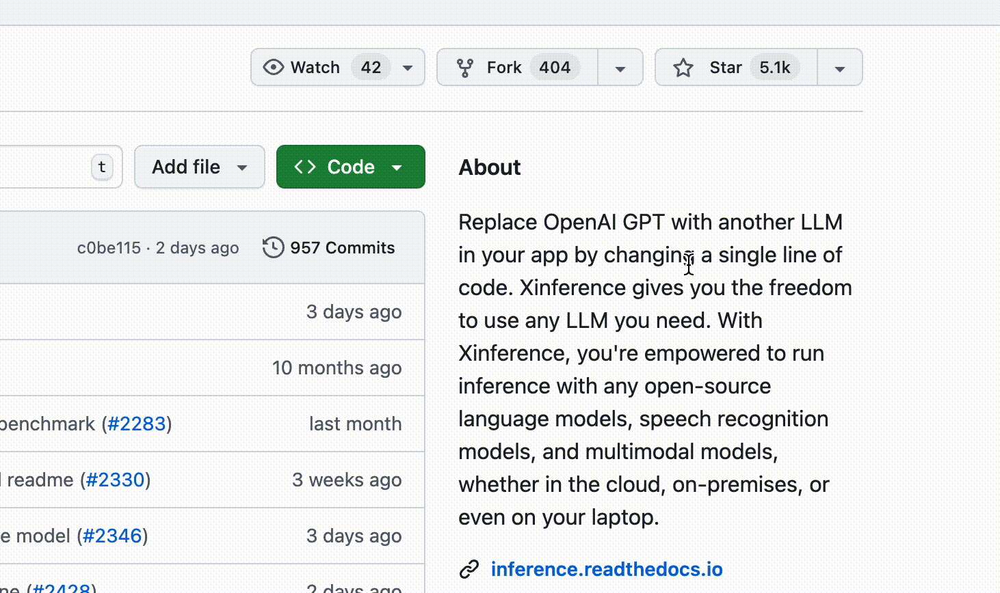
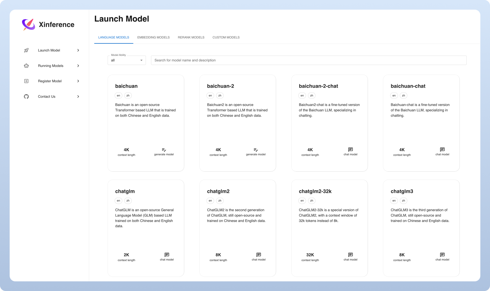

<div align="center">


# Xorbits Inference：模型推理， 轻而易举 🤖

<p align="center">
  <a href="https://xinference.cn">Xinference 企业版</a> ·
  <a href="https://inference.readthedocs.io/zh-cn/latest/getting_started/installation.html#installation">自托管</a> ·
  <a href="https://inference.readthedocs.io/zh-cn/latest/index.html">文档</a>
</p>

[](https://pypi.org/project/xinference/)
[](https://github.com/xorbitsai/inference/blob/main/LICENSE)
[](https://actions-badge.atrox.dev/xorbitsai/inference/goto?ref=main)
[](https://hub.docker.com/r/xprobe/xinference)
[](https://xinference.cn/images/WeCom.jpg)
[](https://www.zhihu.com/org/xorbits)

<p align="center">
  <a href="./README.md"></a>
  <a href="./README_zh_CN.md"></a>
  <a href="./README_ja_JP.md"></a>
</p>
</div>
<br />


Xorbits Inference（Xinference）是一个性能强大且功能全面的分布式推理框架。可用于大语言模型（LLM），语音识别模型，多模态模型等各种模型的推理。通过 Xorbits Inference，你可以轻松地一键部署你自己的模型或内置的前沿开源模型。无论你是研究者，开发者，或是数据科学家，都可以通过 Xorbits Inference 与最前沿的 AI 模型，发掘更多可能。


<div align="center">
<i><a href="https://xinference.cn/images/WeCom.jpg">👉 添加企业微信、加入Xinference社区!</a></i>
</div>

## 🔥 近期热点
### 框架增强
- 自动 Batch: 多个并发请求会被自动合批处理，大幅提升吞吐量。: [#4197](https://github.com/xorbitsai/inference/pull/4197)
- 支持寒武纪芯片：[#3693](https://github.com/xorbitsai/inference/pull/3693)
- [Xllamacpp](https://github.com/xorbitsai/xllamacpp): 全新llama.cpp Python binding，由 Xinference 团队维护，支持持续并行且更生产可用: [#2997](https://github.com/xorbitsai/inference/pull/2997)
- 分布式推理：在多个 worker 上运行大尺寸模型：[#2877](https://github.com/xorbitsai/inference/pull/2877)
- VLLM 引擎增强: 跨副本共享KV Cache: [#2732](https://github.com/xorbitsai/inference/pull/2732)
- 支持 Transformers 引擎的持续批处理: [#1724](https://github.com/xorbitsai/inference/pull/1724)
- 支持针对苹果芯片优化的MLX后端: [#1765](https://github.com/xorbitsai/inference/pull/1765)
- 支持加载模型时指定 worker 和 GPU 索引: [#1195](https://github.com/xorbitsai/inference/pull/1195)
- 支持 SGLang 后端: [#1161](https://github.com/xorbitsai/inference/pull/1161)
### 新模型
- 内置 [Qwen-3.5](https://github.com/QwenLM/Qwen3.5): [#4639](https://github.com/xorbitsai/inference/pull/4639)
- 内置 [GLM-5](https://github.com/zai-org/GLM-5): [#4638](https://github.com/xorbitsai/inference/pull/4638)
- 内置 [MiniMax-M2.5](https://github.com/MiniMax-AI/MiniMax-M2.5): [#4630](https://github.com/xorbitsai/inference/pull/4630)
- 内置 [Kimi-K2.5](https://github.com/MoonshotAI/Kimi-K2.5): [#4631](https://github.com/xorbitsai/inference/pull/4631)
- 内置 [FLUX.2-Klein](https://bfl.ai/models/flux-2-klein): [#4596](https://github.com/xorbitsai/inference/pull/4596)
- 内置 [Qwen3-ASR](https://github.com/QwenLM/Qwen3-ASR): [#4581](https://github.com/xorbitsai/inference/pull/4581)
- 内置 [GLM-4.7](https://huggingface.co/zai-org/GLM-4.7): [#4565](https://github.com/xorbitsai/inference/pull/4565)
- 内置 [MinerU2.5-2509-1.2B](https://huggingface.co/opendatalab/MinerU2.5-2509-1.2B): [#4569](https://github.com/xorbitsai/inference/pull/4569)
### 集成
- [FastGPT](https://doc.fastai.site/docs/development/custom-models/xinference/)：一个基于 LLM 大模型的开源 AI 知识库构建平台。提供了开箱即用的数据处理、模型调用、RAG 检索、可视化 AI 工作流编排等能力，帮助您轻松实现复杂的问答场景。
- [Dify](https://docs.dify.ai/advanced/model-configuration/xinference): 一个涵盖了大型语言模型开发、部署、维护和优化的 LLMOps 平台。
- [RAGFlow](https://github.com/infiniflow/ragflow): 是一款基于深度文档理解构建的开源 RAG 引擎。
- [MaxKB](https://github.com/1Panel-dev/MaxKB): MaxKB = Max Knowledge Base，是一款基于大语言模型和 RAG 的开源知识库问答系统，广泛应用于智能客服、企业内部知识库、学术研究与教育等场景。
- [Chatbox](https://chatboxai.app/): 一个支持前沿大语言模型的桌面客户端，支持 Windows，Mac，以及 Linux。

## 主要功能
🌟 **模型推理，轻而易举**：大语言模型，语音识别模型，多模态模型的部署流程被大大简化。一个命令即可完成模型的部署工作。 

⚡️ **前沿模型，应有尽有**：框架内置众多中英文的前沿大语言模型，包括 baichuan，chatglm2 等，一键即可体验！内置模型列表还在快速更新中！

🖥 **异构硬件，快如闪电**：通过 [ggml](https://github.com/ggerganov/ggml)，同时使用你的 GPU 与 CPU 进行推理，降低延迟，提高吞吐！

⚙️ **接口调用，灵活多样**：提供多种使用模型的接口，包括 OpenAI 兼容的 RESTful API（包括 Function Calling），RPC，命令行，web UI 等等。方便模型的管理与交互。

🌐 **集群计算，分布协同**: 支持分布式部署，通过内置的资源调度器，让不同大小的模型按需调度到不同机器，充分使用集群资源。

🔌 **开放生态，无缝对接**: 与流行的三方库无缝对接，包括 [LangChain](https://python.langchain.com/docs/integrations/providers/xinference)，[LlamaIndex](https://gpt-index.readthedocs.io/en/stable/examples/llm/XinferenceLocalDeployment.html#i-run-pip-install-xinference-all-in-a-terminal-window)，[Dify](https://docs.dify.ai/advanced/model-configuration/xinference)，以及 [Chatbox](https://chatboxai.app/)。

## 为什么选择 Xinference
| 功能特点                    | Xinference | FastChat | OpenLLM | RayLLM |
|-------------------------|------------|----------|---------|--------|
| 兼容 OpenAI 的 RESTful API | ✅ | ✅ | ✅ | ✅ |
| vLLM 集成                 | ✅ | ✅ | ✅ | ✅ |
| 更多推理引擎（GGML、TensorRT）   | ✅ | ❌ | ✅ | ✅ |
| 更多平台支持（CPU、Metal）       | ✅ | ✅ | ❌ | ❌ |
| 分布式集群部署                 | ✅ | ❌ | ❌ | ✅ |
| 图像模型（文生图）               | ✅ | ✅ | ❌ | ❌ |
| 文本嵌入模型                  | ✅ | ❌ | ❌ | ❌ |
| 多模态模型                   | ✅ | ❌ | ❌ | ❌ |
| 语音识别模型                  | ✅ | ❌ | ❌ | ❌ |
| 更多 OpenAI 功能 (函数调用)     | ✅ | ❌ | ❌ | ❌ |

## 使用 Xinference

- **自托管 Xinference 社区版</br>**
使用 [入门指南](#getting-started) 快速在你自己的环境中运行 Xinference。
参考 [文档](https://inference.readthedocs.io/zh-cn) 以获得参考和更多说明。

- **面向企业/组织的 Xinference 版本</br>**
我们提供额外的面向企业的功能。 [通过企业微信联系](https://xinference.cn/images/WeCom.jpg)
或 [提交表单](https://w8v6grm432.feishu.cn/share/base/form/shrcn9u1EBXQxmGMqILEjguuGoh) 讨论企业需求。 </br>

## 保持领先

在 GitHub 上给 Xinference Star，并立即收到新版本的通知。



## 入门指南

* [文档](https://inference.readthedocs.io/zh-cn/latest/index.html)
* [内置模型](https://inference.readthedocs.io/zh-cn/latest/models/builtin/index.html)
* [自定义模型](https://inference.readthedocs.io/zh-cn/latest/models/custom.html)
* [部署文档](https://inference.readthedocs.io/zh-cn/latest/getting_started/using_xinference.html)
* [示例和教程](https://inference.readthedocs.io/zh-cn/latest/examples/index.html)

### Jupyter Notebook

体验 Xinference 最轻量级的方式是使用我们 [Google Colab 上的 Jupyter Notebook](https://colab.research.google.com/github/xorbitsai/inference/blob/main/examples/Xinference_Quick_Start.ipynb)。

### Docker

Nvidia GPU 用户可以使用[Xinference Docker 镜像](https://inference.readthedocs.io/zh-cn/latest/getting_started/using_docker_image.html) 启动 Xinference 服务器。在执行安装命令之前，确保你的系统中已经安装了 [Docker](https://docs.docker.com/get-docker/) 和 [CUDA](https://developer.nvidia.com/cuda-downloads)。

### Kubernetes

确保你的 Kubernetes 集群开启了 GPU 支持，然后通过 `helm` 进行如下方式的安装。

```
# 新增xinference仓库
helm repo add xinference https://xorbitsai.github.io/xinference-helm-charts

# 更新仓库，查询可安装的版本
helm repo update xinference
helm search repo xinference/xinference --devel --versions

# 在K8s中安装xinference
helm install xinference xinference/xinference -n xinference --version 0.0.1-v<xinference_release_version>
```

更多定制化安装方式，请参考[文档](https://inference.readthedocs.io/en/latest/getting_started/using_kubernetes.html)。

### 快速开始

使用 pip 安装 Xinference，操作如下。（更多选项，请参阅[安装页面](https://inference.readthedocs.io/zh-cn/latest/getting_started/installation.html)。）

```bash
pip install "xinference[all]"
```

要启动一个本地的 Xinference 实例，请运行以下命令：

```bash
$ xinference-local
```

一旦 Xinference 运行起来，你可以通过多种方式尝试它：通过网络界面、通过 cURL、通过命令行或通过 Xinference 的 Python 客户端。更多指南，请查看我们的[文档](https://inference.readthedocs.io/zh-cn/latest/getting_started/using_xinference.html#run-xinference-locally)。



## 参与其中

| 平台                                                                                              | 目的                   |
|-------------------------------------------------------------------------------------------------|----------------------|
| [Github 问题](https://github.com/xorbitsai/inference/issues)                                      | 报告错误和提交功能请求。         |
| [Discord](https://discord.gg/Xw9tszSkr5) | 与其他 Xinference 用户合作。 |
| [Twitter](https://twitter.com/xorbitsio)                                                        | 及时了解新功能。             |
| [微信社群](https://xinference.cn/images/WeCom.jpg)                                     | 与其他 Xinference 用户交流。 |
| [知乎](https://zhihu.com/org/xorbits)                                                             | 了解团队最新的进展。           |

## 引用

如果您觉得此项目有帮助，请以如下格式引用我们：

```bibtex
@inproceedings{lu2024xinference,
    title = "Xinference: Making Large Model Serving Easy",
    author = "Lu, Weizheng and Xiong, Lingfeng and Zhang, Feng and Qin, Xuye and Chen, Yueguo",
    booktitle = "Proceedings of the 2024 Conference on Empirical Methods in Natural Language Processing: System Demonstrations",
    month = nov,
    year = "2024",
    address = "Miami, Florida, USA",
    publisher = "Association for Computational Linguistics",
    url = "https://aclanthology.org/2024.emnlp-demo.30",
    pages = "291--300",
}
```

## 合作

* [琶洲实验室 | 黄埔](https://www.pazhoulab-huangpu.com/#/)

## 贡献者

<a href="https://github.com/xorbitsai/inference/graphs/contributors">
  
</a>

## Star 历史

[](https://star-history.com/#xorbitsai/inference&Date)