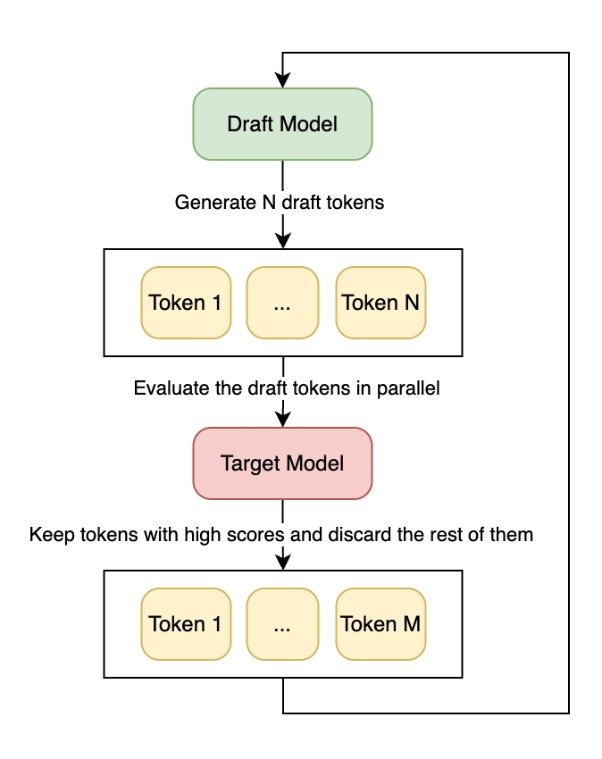

.. _user_guide_spec_decoding:

===================================
Speculative Decoding (experimental)
===================================

.. image:: ../_static/speculative_decoding.gif

Speculative decoding is a method designed to speed up the inference process of large language models (LLMs). This technique involves using a smaller, quicker "draft" model to produce several tokens in advance. These tokens are then checked by a more extensive "target" model. If the larger model confirms the tokens generated by the draft model, it leads to significant savings in memory bandwidth and processing time per token. However, if the tokens from the draft model don't match the predictions of the larger model, they are discarded.

Launching a speculative LLM
~~~~~~~~~~~~~~~~~~~~~~~~~~~
Using speculative decoding in Xinference is straightforward. The only distinction between speculative decoding and regular decoding is the way to initiate an LLM:

.. code-block:: python

   from xinference.client import Client

   client = Client("http://localhost:9997")
   model_uid = client.launch_speculative_llm(
       model_name="wizardcoder-python-v1.0",        # target model name
       model_size_in_billions=34,                   # target model size
       quantization="none",                         # target model quantization
       draft_model_name="wizardcoder-python-v1.0",  # draft model name
       draft_model_size_in_billions=7,              # draft model size
       draft_quantization="none",                   # draft model quantization
       n_gpu=2                                      # number of GPUs to use
   )

.. note::

   ``Client.launch_speculative_llm`` is an experimental API, which may be removed in the future releases.

After launching the model, you can use it just like a regular model:

.. code-block:: python

   model = client.get_model(model_uid)
   model.chat(
       """Determine if a 9 x 9 Sudoku board is valid. Only the filled cells need to be validated according to the following rules:
   1. Each row must contain the digits 1-9 without repetition.
   2. Each column must contain the digits 1-9 without repetition.
   3. Each of the nine 3 x 3 sub-boxes of the grid must contain the digits 1-9 without repetition.
   Note:
   A Sudoku board (partially filled) could be valid but is not necessarily solvable. Only the filled cells need to be validated according to the mentioned rules."""
   )

Performance
~~~~~~~~~~~
The effectiveness of speculative decoding relies on:

- The size difference between the models - the larger, the better.
- The similarity between the logits produced by the draft model and the target model.

In the example above, the target model is about five times larger than the draft model, and the two models are well aligned. Approximately 86% of the draft tokens are accepted by the target model, resulting in a 25% increase in speed.

References
~~~~~~~~~~
- [1] `Fast Inference from Transformers via Speculative Decoding <https://arxiv.org/abs/2211.17192>`_
- [2] `Accelerating Large Language Model Decoding with Speculative Sampling <https://arxiv.org/abs/2302.01318>`_
